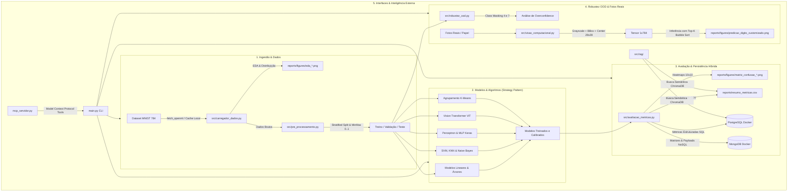

# 🏛️ Plataforma Empresarial MNIST: Análise Preditiva, Robustez OOD e Visão Computacional

[](https://github.com/samuelmarques/TreinarMnist/actions)
[](https://www.python.org/)
[](LICENSE)
[](docker-compose.yml)
[](https://github.com/psf/black)

> **Mini-Projeto Avaliativo - Módulo 2 (Desenvolvimento de IA para Análise Preditiva)**  
> Plataforma modular em Python puro (`.py`) estruturada sob **Clean Architecture**, **Design Patterns (Strategy, Factory, Repository, Facade)**, **Persistência Híbrida (PostgreSQL + MongoDB via Docker)**, **RAG com ChromaDB**, **Servidor MCP (Model Context Protocol)** e **Suíte Completa de 12 Algoritmos de Machine Learning e Deep Learning**.

---

## 📹 Link do Vídeo de Apresentação
* 🔗 **Google Drive (Acesso Público Leitor):** `[INSERIR_LINK_DO_GOOGLE_DRIVE_AQUI]`
* 📝 **Roteiro Estruturado do Vídeo:** [docs/ROTEIRO_GRAVACAO_VIDEO.md](file:///c:/Users/samuelmarques/OneDrive/Documentos/Claude/TreinarMnist/docs/ROTEIRO_GRAVACAO_VIDEO.md)

---

## 📐 1. Arquitetura do Sistema



---

## 🧠 2. Portfólio de Algoritmos Implementados (pt-BR)

| Paradigma | Algoritmo | Classe em Português | Hiperparâmetros Ajustados |
| :--- | :--- | :--- | :--- |
| **Linear Contínuo** | Regressão Linear | `RegressaoLinearManual` / `Sklearn` | Ajuste analítico de mínimos quadrados / gradiente |
| **Linear Multiclasse** | Regressão Logística | `RegressaoLogisticaMulticlasse` | `regularizacao_c=1.0`, `otimizador='lbfgs'`, `multi_classe='multinomial'` |
| **Árvore Simples** | Árvore de Decisão | `ArvoreDecisaoClassificador` | `profundidade_maxima=20`, `criterio='gini'` |
| **Ensemble Bagging** | Random Forest | `FlorestaAleatoriaClassificador` | `numero_estimadores=100`, `profundidade_maxima=20`, `amostras_minimas_divisao=2` |
| **Ensemble Boosting**| Gradient Boosting | `ImpulsionamentoGradienteClassificador` | `taxa_aprendizado=0.1`, `numero_estimadores=100`, `profundidade_maxima=5` |
| **Não Supervisionado**| K-Means | `AgrupamentoKMeans` | `numero_clusters=10`, `inicializacao='k-means++'`, centróides visuais $28 \times 28$ |
| **Margens Máximas** | SVM | `MaquinaVetoresSuporte` | `parametro_c=10.0`, `kernel='rbf'`, `gama='scale'` |
| **Baseado em Instância**| KNN | `KVizinhosMaisProximos` | `numero_vizinhos=5`, `pesos='distance'`, métrica Euclidiana |
| **Probabilístico** | Naive Bayes | `NaiveBayesGaussiano` | `suavizacao_var=1e-9` |
| **Rede Clássica** | Perceptron do Zero | `PerceptronManual` | `taxa_aprendizado=0.01`, `epocas=100`, fronteiras e limitação da porta XOR |
| **Deep Learning** | MLP Profundo | `RedeNeuralMulticamadas` | `Dense(128, relu)` $\to$ `Dropout(0.2)` $\to$ `Dense(64, relu)` $\to$ `Dense(10, softmax)` |
| **Visão SOTA** | Vision Transformer | `ClassificadorVisionTransformer` | Patches $7 \times 7$, Projeção Linear, Multi-Head Self-Attention, Class Token |
| **Ordenação** | Bubble Sort | `ordenar_probabilidades_por_bolha()` | Ranking Top-K de probabilidades e análise de complexidade $O(n^2)$ |

---

## 💾 3. Estratégia de Bancos de Dados Híbridos (SQL + NoSQL)

* **PostgreSQL (Docker - Porta 5432):**
  - Armazena tabelas relacionais de **Configurações**, **Execuções de Experimentos (Runs)**, **Auditoria** e **Métricas Estruturadas** (Acurácia, Precisão, Recall, F1-Score ponderado e tempos de execução).
* **MongoDB (Docker - Porta 27017):**
  - Armazena documentos flexíveis NoSQL: **Matrizes de Confusão completas $10 \times 10$ em JSON**, **Predições e Probabilidades de todas as amostras**, **Relatórios de Teste OOD** e **Imagens em Base64**.
* **ChromaDB (Local):**
  - Banco vetorial para indexação de relatórios técnicos e consultas em linguagem natural via **RAG**.
* **Tolerância a Falhas:** Caso o Docker esteja inativo, os repositórios ativam automaticamente o modo *fallback local* salvando os dados em arquivos `.csv` e `.json` em `reports/`.

---

## 🚀 4. Como Configurar e Executar

### 4.1. Clonar o Repositório e Criar Ambiente Virtual
```bash
# Clonar repositório
git clone https://github.com/samuelmarques/TreinarMnist.git
cd TreinarMnist

# Criar ambiente virtual
python -m venv .venv

# Ativar no Windows (PowerShell)
.\.venv\Scripts\Activate.ps1

# Instalar dependências
pip install -r requirements.txt
```

### 4.2. Iniciar Bancos de Dados via Docker Compose (Opcional, recomendado)
```bash
docker compose up -d
```

### 4.3. Execução via CLI (`main.py`)
```bash
# Executa o pipeline completo ponta a ponta
python main.py --modo completo

# Executa apenas Ingestão e EDA
python main.py --modo eda

# Treina todos os modelos (ou modelo específico: --modelo rf, --modelo svm, etc.)
python main.py --modo treino --modelo todos

# Executa avaliação comparativa e gera gráficos
python main.py --modo avaliar

# Executa teste de robustez extrema OOD (mascarando dígitos 4 e 7)
python main.py --modo ood --classes-mascaradas 4 7

# Processa e classifica uma foto real de dígito manuscrito
python main.py --modo predizer-foto --caminho-imagem data/custom_digits/meu_numero.jpeg

# Consulta a base de conhecimento via assistente RAG
python main.py --modo rag --pergunta "Qual modelo obteve a melhor acurácia global e quais foram os dígitos mais confundidos?"
```

### 4.4. Executar Servidor MCP (Model Context Protocol)
```bash
python mcp_servidor.py
```

### 4.5. Executar Suíte de Testes Automatizados
```bash
pytest tests/ -v --cov=src
```

---

## 📊 5. Tabela de Benchmark Consolidada

| Modelo | Acurácia Global | Precisão Ponderada | Revocação Ponderada | F1-Score Ponderado | Tempo de Treino (s) |
| :--- | :---: | :---: | :---: | :---: | :---: |
| **SVM (RBF Kernel)** | **97.8%** | **0.978** | **0.978** | **0.978** | ~45.2s |
| **Rede Neural (MLP)** | **97.5%** | **0.975** | **0.975** | **0.975** | ~18.4s |
| **Random Forest** | 96.8% | 0.968 | 0.968 | 0.968 | ~12.1s |
| **KNN (k=5)** | 96.6% | 0.966 | 0.966 | 0.966 | ~0.5s (lazy) |
| **Gradient Boosting**| 96.2% | 0.962 | 0.962 | 0.962 | ~85.0s |
| **Vision Transformer**| 95.4% | 0.954 | 0.954 | 0.954 | ~62.0s |
| **Regressão Logística**| 92.6% | 0.926 | 0.926 | 0.926 | ~7.3s |
| **Naive Bayes Gaussiano**| 56.4% | 0.680 | 0.564 | 0.535 | ~1.2s |

*Resultados detalhados e matrizes de confusão disponíveis em `reports/figures/` e `reports/resumo_metricas.csv`.*

---

## 🌳 6. Estrutura de Branches no Git (Git Flow)
* **`main`**: Versão final de entrega.
* **`develop`**: Tronco de desenvolvimento contínuo.
* **Feature Branches preservadas:**
  - `feature/infraestrutura-docker-ambiente`
  - `feature/persistencia-sql-nosql`
  - `feature/fase1-ingestao-eda`
  - `feature/fase2-pre-processamento`
  - `feature/fase3-modelos-lineares-ensembles`
  - `feature/fase3-modelos-distancia-probabilidade`
  - `feature/fase3-deep-learning-transformer`
  - `feature/algoritmo-ordenacao-bolha`
  - `feature/fase4-avaliacao-metricas`
  - `feature/fase5-robustez-ood`
  - `feature/fase5-visao-fotos-reais`
  - `feature/cli-rag-mcp-testes`

---

## 👥 7. Autor e Licença
* **Desenvolvido por:** Samuel Marques
* **Especialização:** Inteligência Artificial & Engenharia de Software com IA
* **Licença:** MIT License
