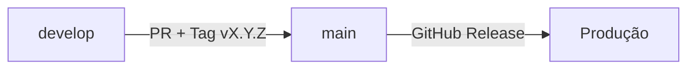

# Fluxo de Trabalho GitHub, Kanban e CI/CD — TreinarMnist

> **Versão:** 1.1  
> **Data:** 2026-09-11  
> **Repositório:** `samuelmarquesgit/TreinarMnist`  

---

## 1. Fluxo Principal (Git Flow)

```
feature/*  →  Pull Request  →  develop  →  Pull Request  →  main
```

| Branch | Finalidade | Regras |
|--------|------------|--------|
| `main` | Produção final, estável | Apenas via PR aprovado vindo de `develop`; CI-Gate obrigatório |
| `develop` | Integração contínua | Base para features; CI roda a cada push |
| `feature/tm-XXX-descricao` | Nova funcionalidade/task | Criada a partir de `develop`; convenção `tm-XXX` obrigatória |
| `fix/tm-XXX-descricao` | Correção de bug | Mesma convenção |
| `docs/tm-XXX-descricao` | Documentação | Mesma convenção |

> **Regra do Edital:** Branches de feature **não são excluídas** após merge. Histórico completo preservado.

---

## 2. Convenção de Commits (Imperativo em Português)

| Tipo | Exemplo Correto | Exemplo Incorreto |
|-------|-----------------|-------------------|
| `feat` | `feat: implementa CLI alinhada à documentação` | `feat: CLI fix` |
| `fix` | `fix: corrige caminho do servidor MCP` | `fix: mcp path` |
| `docs` | `docs: atualiza README com modelos reais` | `docs: update readme` |
| `refactor` | `refactor: centraliza configuração em src/config.py` | `refactor: config` |
| `test` | `test: adiciona testes de integração OOD` | `test: add tests` |
| `chore` | `chore: atualiza dependências fixas` | `chore: deps` |

**Formato:** `<tipo>: <verbo imperativo> <objeto> [detalhe]`

---

## 3. Orquestrador GitHub (Scripts)

Script auxiliar: `scripts/orquestrador_github.py` (usa `gh` CLI).

### Passo 1: Criar Issue Semântica e Vincular ao Kanban
```bash
python scripts/orquestrador_github.py issue \
  --tipo "feat" \
  --titulo "Alinhar CLI à documentação" \
  --desc "Implementar modos completo, eda, treino, avaliar, ood, predizer-foto, rag no main.py"
# Anote o número da issue gerado (ex: 42)
```

### Passo 2: Criar Branch Semântica
```bash
python scripts/orquestrador_github.py branch \
  --issue 42 \
  --tipo "feat" \
  --desc "cli-align"
# Cria branch: feat/tm-001-cli-align
```

### Passo 3: Commits Semânticos
```bash
git commit -m "feat: implementa parser de argumentos com modos completos"
git commit -m "test: adiciona testes de integração para cada modo CLI"
```

### Passo 4: Pull Request
```bash
python scripts/orquestrador_github.py pr \
  --issue 42 \
  --branch "feat/tm-001-cli-align"
# PR abre para develop; texto inclui "Closes #42" → move card no Kanban automaticamente
```

---

## 4. Pipeline CI/CD (GitHub Actions)

Arquivo: `.github/workflows/ci.yml`

### Jobs Executados

| Job | Finalidade | Ferramentas | Gate? |
|-------|------------|-------------|-------|
| **qualidade-e-testes** | Lint, tipagem, testes, cobertura | `ruff`, `mypy`, `pytest --cov=src`, `safety` | ✅ Sim (falha bloqueia) |
| **seguranca-scan** | Secrets + imagem Docker | `trufflehog`, `trivy` (exit-code: 0) | ⚠️ Informativo (exit-code 0) |
| **sonarcloud-scan** | Qualidade código (Code Smells, Bugs, Duplicação) | `SonarSource/sonarcloud-github-action` | ✅ Sim (Quality Gate) |
| **ci-gate** | Consolidador | Verifica jobs anteriores | ✅ Sim (bloqueia merge se qualquer job crítico falhar) |

> **Observação Atual (Set/2026):**
> - `safety check ... || true` → **não bloqueia** (sempre passa)
> - `trivy` com `exit-code: 0` → **não bloqueia** (sempre passa)
> - **Nenhum gate de cobertura** (`--cov-fail-under` ausente) — ver TM-010
> - **Security scans informativos apenas** — ver TM-010

### Configuração Atual (Resumo)
```yaml
# Python versions
CI: 3.10
mypy.ini: 3.12
ruff.toml: py310
Local (set/2026): 3.14.0  # Alinhar em TM-007
```

---

## 5. Projeto Kanban (GitHub Projects)

**Projeto:** ID 6 (verificar se atual)  
**Colunas:** `Todo` → `Em Andamento` → `Revisão` → `Concluído`  
**Automação:** `Closes #N` no PR move card para `Concluído`.

### Cards por Épico (Resumo)

| Épico | Cards (Tasks) |
|-------|---------------|
| EPIC-01 | TM-007, TM-009, TM-010, TM-011, TM-012 |
| EPIC-02 | TM-008, TM-013 |
| EPIC-03 | — (concluído) |
| EPIC-04 | TM-003, TM-005 |
| EPIC-05 | TM-004, TM-006 |
| EPIC-06 | TM-006 |
| EPIC-07 | TM-014 |
| EPIC-08 | — (concluído) |
| EPIC-09 | TM-009, TM-014, TM-016 |
| EPIC-10 | TM-003, TM-015 |
| EPIC-11 | TM-001, TM-002, TM-011, TM-013, TM-018 |
| EPIC-12 | TM-011, TM-015, TM-019 |
| EPIC-13 | TM-017, TM-020 |

---

## 6. Checklist de Pull Request (Template)

```markdown
## Checklist de PR

- [ ] Título segue convenção: `feat: verbo imperativo objeto`
- [ ] Branch nomeada: `feat/tm-XXX-descricao` ou `fix/tm-XXX-descricao`
- [ ] `Closes #N` na descrição (move card no Kanban)
- [ ] Testes locais passando: `pytest -v`, `ruff check`, `mypy src`
- [ ] Cobertura ≥ 60% (após TM-010)
- [ ] Security scans sem bloqueadores críticos
- [ ] Documentação atualizada (README, BACKLOG, TASKS, .md afetados)
- [ ] Checklist DoD preenchido (ver docs/TASKS.md)
- [ ] Revisão solicitada a ≥ 1 revisor
```

---

## 6. Fluxo de Release



1. **Desenvolvimento** ocorre em `develop` via feature branches.
2. **Release Candidate:** PR `develop → main` com tag semver (`v1.0.0`, `v1.1.0`, etc.).
3. **GitHub Release** automático (changelog gerado a partir de commits convencionais).
4. **Docker Image** publicado no GHCR (se configurado).

---

## 7. Boas Práticas de Segurança no Fluxo

- **Secrets:** Nunca commitar `.env`, chaves, tokens. Usar GitHub Secrets para CI.
- **TruffleHog:** Escaneia toda árvore git no CI (job `seguranca-scan`).
- **Dependências:** `safety check` + `pip-audit` no CI (gate efetivo após TM-010).
- **Imagem Docker:** `trivy` scan com `exit-code: 1` após TM-010.
- **SonarCloud:** Quality Gate obrigatório (bugs, code smells, coverage).

---

*Documento revisado em 2026-09-11. Próxima revisão: após TM-010 (gates efetivos).*